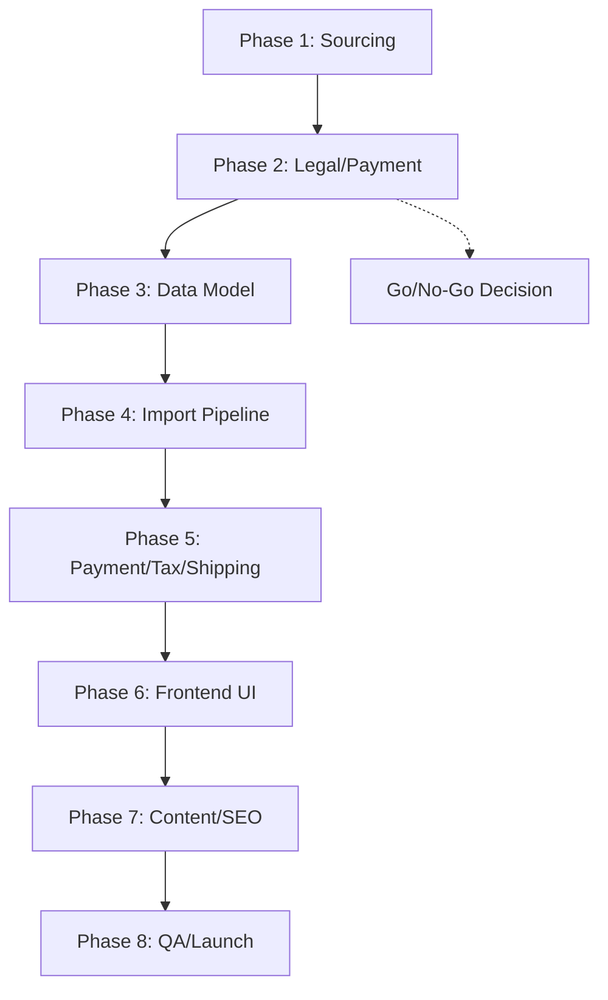

# Sex Toys Product Catalog Implementation Phases

## Executive Summary

This document outlines the 8-phase implementation plan for adding a sex toys product catalog to the existing ogt-web Magento 2 e-commerce platform. The implementation leverages existing infrastructure while introducing minimal risk through careful validation and phased rollout.

**Total Estimated Duration**: 12-16 weeks
**Total Estimated Effort**: 240-320 developer hours
**Go/No-Go Decision Point**: End of Phase 2
**MVP Launch Target**: Phase 8 completion

---

## Phase 1: Supplier & Product Sourcing Research

**Type**: Research & Planning
**Estimated Duration**: 2-3 weeks
**Estimated Effort**: 40-60 hours
**Owner**: Product Manager + Developer
**Dependencies**: None

### Objective
Identify reliable suppliers, curate initial product selection (20-30 SKUs), and establish sourcing relationships for premium, body-safe sex toy products.

### Tasks
- [ ] Research premium sex toy manufacturers (Lelo, Womanizer, Lovehoney)
- [ ] Contact suppliers for wholesale pricing and terms
- [ ] Evaluate product quality standards and certifications
- [ ] Curate initial product selection focusing on wellness/relationship products
- [ ] Assess minimum order quantities and lead times
- [ ] Document supplier agreements and shipping terms
- [ ] Create product photography and content requirements

### Critical Dependencies
**External**: Supplier availability and wholesale terms
**Internal**: Budget approval for initial inventory ($10K-20K)

### Verification Criteria
- [ ] 3+ supplier relationships established
- [ ] 20-30 SKUs selected with pricing and specs
- [ ] Product quality certifications verified
- [ ] Initial inventory budget secured
- [ ] Photography/content plan documented

### Exit Criteria
Supplier relationships established, initial product catalog curated, ready for legal compliance review.

---

## Phase 2: Legal & Payment Acceptance Validation

**Type**: Compliance & Risk Assessment
**Estimated Duration**: 2-3 weeks
**Estimated Effort**: 30-45 hours
**Owner**: Legal Ops + Developer
**Dependencies**: Phase 1 completion

### Objective
Validate payment processor acceptance, assess legal compliance requirements, and establish risk mitigation strategies for adult product sales.

### Tasks
- [ ] Contact Klarna and Stripe representatives for adult product policy
- [ ] Verify merchant account settings and risk thresholds
- [ ] Research local/regional shipping restrictions
- [ ] Review age verification requirements and implementation options
- [ ] Assess tax implications for adult products by region
- [ ] Document compliance requirements and liability considerations
- [ ] Identify alternative payment processors if needed

### Critical Dependencies
**External**: Payment processor policy confirmations
**Internal**: Legal counsel availability

### Verification Criteria
- [ ] Payment processor acceptance confirmed or alternatives identified
- [ ] Shipping restrictions mapped by region
- [ ] Age verification strategy defined
- [ ] Tax implications assessed
- [ ] Risk mitigation plan documented

### Exit Criteria
Payment and legal compliance validated, go/no-go decision ready.

### Go/No-Go Decision Point
If payment processors reject adult products and no viable alternatives exist, project may be cancelled or scoped to alternative product categories.

---

## Phase 3: Data Model & Magento Catalog Design

**Type**: Infrastructure
**Estimated Duration**: 2-3 weeks
**Estimated Effort**: 40-60 hours
**Owner**: Magento Developer
**Dependencies**: Phase 2 completion

### Objective
Design and implement Magento product attributes, categories, and attribute sets specifically for sex toy products while maintaining catalog integrity.

### Tasks
- [ ] Design product attributes (material, size, usage, care instructions)
- [ ] Create sex toy product category structure
- [ ] Implement custom attribute sets for different product types
- [ ] Add discrete labeling attributes (neutral metadata)
- [ ] Configure product templates with educational content sections
- [ ] Set up category-specific pricing rules
- [ ] Implement age verification flags and restrictions

### Critical Dependencies
**Internal**: Magento admin access, existing catalog patterns
**External**: Product data from suppliers

### Verification Criteria
- [ ] Attribute sets created and tested
- [ ] Category structure implemented
- [ ] Product templates functional
- [ ] Age verification logic integrated
- [ ] Data integrity maintained

### Exit Criteria
Magento catalog structure ready for product import, data model validated.

---

## Phase 4: Import Pipeline & Inventory Sync

**Type**: Integration
**Estimated Duration**: 2-3 weeks
**Estimated Effort**: 35-50 hours
**Owner**: Magento Developer
**Dependencies**: Phase 3 completion

### Objective
Build automated product import system, implement inventory synchronization, and establish data quality controls for sex toy catalog.

### Tasks
- [ ] Create CSV import templates with custom attributes
- [ ] Implement bulk import functionality for product catalog
- [ ] Set up inventory sync with supplier systems
- [ ] Configure automated price updates and stock levels
- [ ] Implement data validation and error handling
- [ ] Create import monitoring and reconciliation reports
- [ ] Test import performance with full catalog

### Critical Dependencies
**Internal**: Magento import/export patterns, supplier API access
**External**: Supplier data feeds availability

### Verification Criteria
- [ ] Import templates validated
- [ ] Bulk import processes functional
- [ ] Inventory sync operational
- [ ] Data quality controls implemented
- [ ] Performance benchmarks met

### Exit Criteria
Product import pipeline operational, inventory sync established, ready for payment integration.

---

## Phase 5: Payment, Pricing, Tax & Shipping Integration

**Type**: Integration
**Estimated Duration**: 2-3 weeks
**Estimated Effort**: 30-45 hours
**Owner**: Payment Developer
**Dependencies**: Phase 4 completion

### Objective
Configure payment processing, implement tax rules, and set up discreet shipping options for adult products.

### Tasks
- [ ] Configure Klarna/Stripe for adult product categories
- [ ] Implement category-specific tax rules
- [ ] Set up discreet shipping methods and packaging options
- [ ] Configure shipping restrictions by region
- [ ] Implement neutral invoice labeling
- [ ] Set up payment processing for restricted categories
- [ ] Test checkout flow with adult products

### Critical Dependencies
**Internal**: Existing payment integration patterns
**External**: Payment processor configuration approval

### Verification Criteria
- [ ] Payment processing functional for adult categories
- [ ] Tax calculations accurate
- [ ] Discreet shipping options available
- [ ] Regional restrictions enforced
- [ ] Checkout flow validated

### Exit Criteria
Payment, tax, and shipping fully integrated, checkout flow functional.

---

## Phase 6: Frontend UI & UX Changes

**Type**: Frontend Development
**Estimated Duration**: 3-4 weeks
**Estimated Effort**: 50-70 hours
**Owner**: Frontend Developer
**Dependencies**: Phase 5 completion

### Objective
Implement category pages, product pages, age verification modal, and educational content sections for sex toy catalog.

### Tasks
- [ ] Create sex toy category page templates
- [ ] Implement product detail pages with educational content
- [ ] Build age verification modal and session management
- [ ] Add discreet product labeling and descriptions
- [ ] Implement privacy-focused checkout messaging
- [ ] Create wellness-focused navigation and filtering
- [ ] Optimize mobile experience for sensitive browsing
- [ ] Add trust badges and safety information

### Critical Dependencies
**Internal**: Existing theme patterns, age verification design
**External**: Content from suppliers

### Verification Criteria
- [ ] Category pages functional
- [ ] Product pages display educational content
- [ ] Age verification works correctly
- [ ] Privacy features implemented
- [ ] Mobile optimization complete

### Exit Criteria
Frontend UI complete, age verification functional, ready for content population.

---

## Phase 7: Content Creation, Photography & SEO

**Type**: Content & Marketing
**Estimated Duration**: 2-3 weeks
**Estimated Effort**: 25-35 hours
**Owner**: Content Creator + SEO Specialist
**Dependencies**: Phase 6 completion

### Objective
Create educational product content, optimize for search visibility, and implement privacy-conscious SEO strategy.

### Tasks
- [ ] Write educational product descriptions and usage guides
- [ ] Optimize product photography for web display
- [ ] Implement SEO-friendly URLs and meta descriptions
- [ ] Create category landing pages with wellness messaging
- [ ] Set up privacy-focused internal linking structure
- [ ] Implement schema markup for products
- [ ] Create discreet social media content strategy
- [ ] Optimize for adult product search visibility

### Critical Dependencies
**Internal**: Product data from imports
**External**: Photography resources, SEO tools

### Verification Criteria
- [ ] Educational content created for all products
- [ ] SEO optimization implemented
- [ ] Privacy-conscious content strategy defined
- [ ] Schema markup functional
- [ ] Search visibility improved

### Exit Criteria
Content complete, SEO optimized, ready for QA and launch.

---

## Phase 8: QA, Compliance Review, Launch & Monitoring

**Type**: Testing & Launch
**Estimated Duration**: 2-3 weeks
**Estimated Effort**: 30-40 hours
**Owner**: QA Engineer + Ops Lead
**Dependencies**: Phase 7 completion

### Objective
Conduct comprehensive testing, compliance audit, and launch the sex toy catalog with monitoring and optimization.

### Tasks
- [ ] Execute functional testing of catalog and checkout
- [ ] Perform compliance audit and age verification testing
- [ ] Conduct performance testing and optimization
- [ ] Implement monitoring and alerting for adult products
- [ ] Create launch checklist and rollback procedures
- [ ] Execute soft launch with limited traffic
- [ ] Monitor performance and user behavior
- [ ] Optimize based on initial data

### Critical Dependencies
**Internal**: All previous phases complete
**External**: Legal compliance sign-off

### Verification Criteria
- [ ] All test cases pass
- [ ] Compliance audit complete
- [ ] Performance benchmarks met
- [ ] Monitoring systems operational
- [ ] Launch procedures documented

### Exit Criteria
MVP launched successfully, monitoring established, optimization underway.

---

## Phase Dependencies Overview

## Risk Mitigation Timeline

| Risk | Mitigation Phase | Owner | Success Criteria |
|------|------------------|-------|------------------|
| Payment rejection | Phase 2 | Legal Ops | Alternative processor identified |
| Legal non-compliance | Phase 2 | Legal Counsel | Compliance strategy approved |
| Supplier issues | Phase 1 | Product Manager | Backup suppliers secured |
| Import failures | Phase 4 | Developer | Rollback procedures tested |
| Age verification UX issues | Phase 6 | UX Designer | User testing completed |

## Success Metrics by Phase

| Phase | Primary Metric | Target | Measurement |
|-------|----------------|--------|-------------|
| 1 | Supplier relationships | 3+ established | Contract signatures |
| 2 | Payment acceptance | Confirmed | Processor documentation |
| 3 | Catalog structure | 100% functional | Import test success |
| 4 | Import performance | <5 min for 100 products | Automated tests |
| 5 | Checkout completion | 95%+ success rate | Test transactions |
| 6 | Age verification | 100% compliance | Automated checks |
| 7 | SEO visibility | Top 20 for target keywords | Search console data |
| 8 | Launch stability | 99.9% uptime | Monitoring dashboard |

---

*Implementation phases for sex toys catalog addition - November 30, 2025*