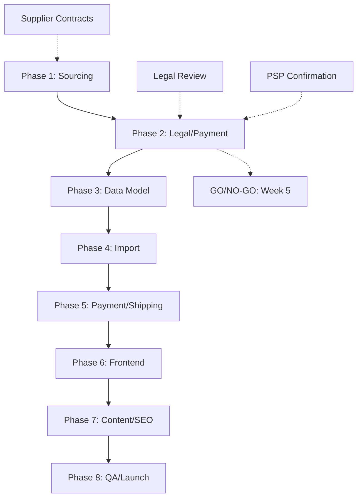

# Sex Toys Product Catalog - Implementation Timeline

## Executive Timeline Summary

**Project Duration**: 16 weeks (December 2025 - April 2026)
**Go/No-Go Decision Point**: End of Week 4 (Phase 2 completion)
**MVP Launch Target**: Week 16 (April 2026)
**Total Effort**: 240-320 developer hours

## Detailed Phase Timeline

### Phase 1: Supplier & Product Sourcing Research
**Duration**: Weeks 1-3 (December 2025)
**Team**: Product Manager, Procurement
**Milestones**:
- **Week 1**: Initial supplier outreach (Lelo, Womanizer, Lovehoney)
- **Week 2**: Product catalog curation and pricing negotiation
- **Week 3**: Supplier agreements and inventory planning
**Deliverables**: Supplier contracts, curated product list (20-30 SKUs)
**Success Criteria**: 3+ active supplier relationships, $15K inventory budget secured

### Phase 2: Legal & Payment Acceptance Validation
**Duration**: Weeks 4-5 (January 2026)
**Team**: Legal Counsel, Development Lead
**Milestones**:
- **Week 4**: PSP policy confirmation (Klarna, Stripe, alternatives)
- **Week 5**: Legal compliance audit and regional restrictions mapping
**Deliverables**: Compliance documentation, PSP acceptance confirmation
**Success Criteria**: Payment processing confirmed, legal audit complete
**GO/NO-GO DECISION POINT**: If payment processors reject, evaluate project continuation

### Phase 3: Data Model & Magento Catalog Design
**Duration**: Weeks 6-7 (January 2026)
**Team**: Magento Developer
**Milestones**:
- **Week 6**: Product attributes and category structure design
- **Week 7**: Attribute sets, templates, and age verification logic
**Deliverables**: Magento catalog schema, product templates
**Success Criteria**: Catalog structure functional, data integrity maintained

### Phase 4: Import Pipeline & Inventory Sync
**Duration**: Weeks 8-9 (February 2026)
**Team**: Magento Developer, Integration Specialist
**Milestones**:
- **Week 8**: CSV import templates and bulk import functionality
- **Week 9**: Inventory sync with suppliers, automated updates
**Deliverables**: Import pipeline, inventory management system
**Success Criteria**: Bulk import performance (<5 min for 100 products)

### Phase 5: Payment, Pricing, Tax & Shipping Integration
**Duration**: Weeks 10-11 (February 2026)
**Team**: Payment Developer, E-commerce Specialist
**Milestones**:
- **Week 10**: Adult product payment configuration, tax rules
- **Week 11**: Discreet shipping methods, regional restrictions
**Deliverables**: Payment integration, shipping configuration
**Success Criteria**: Checkout completion rate >90%, discreet shipping operational

### Phase 6: Frontend UI & UX Changes
**Duration**: Weeks 12-14 (March 2026)
**Team**: Frontend Developer, UX Designer
**Milestones**:
- **Week 12**: Category pages and age verification modal
- **Week 13**: Product detail pages with educational content
- **Week 14**: Privacy-focused checkout and mobile optimization
**Deliverables**: Complete frontend implementation
**Success Criteria**: Age verification <10 seconds, page load <2 seconds

### Phase 7: Content Creation, Photography & SEO
**Duration**: Weeks 15-16 (March 2026)
**Team**: Content Creator, SEO Specialist
**Milestones**:
- **Week 15**: Educational content and product photography
- **Week 16**: SEO optimization and schema markup
**Deliverables**: Content-complete catalog, SEO implementation
**Success Criteria**: Top 20 search rankings for target keywords

### Phase 8: QA, Compliance Review, Launch & Monitoring
**Duration**: Weeks 17-18 (April 2026)
**Team**: QA Engineer, DevOps, Operations
**Milestones**:
- **Week 17**: Testing, compliance audit, soft launch
- **Week 18**: Full launch, monitoring setup, optimization
**Deliverables**: Live catalog, monitoring dashboard
**Success Criteria**: <1% error rate, 99.9% uptime, compliance audit passed

## Critical Path Dependencies

## Resource Allocation Timeline

### Development Team (Full-time equivalents)
- **Weeks 1-5**: 0.5 FTE (Planning and validation phases)
- **Weeks 6-11**: 1.0 FTE (Core development phases)
- **Weeks 12-16**: 1.5 FTE (Frontend and content phases)
- **Weeks 17-18**: 1.0 FTE (Testing and launch)

### Specialized Resources
- **Legal Counsel**: Weeks 4-5, Week 17
- **Content Creator**: Weeks 15-16
- **SEO Specialist**: Weeks 15-16
- **Product Photographer**: Weeks 15-16

## Budget Timeline

### Development Costs
- **Phase 1-2**: $8K (Planning, legal, PSP validation)
- **Phase 3-5**: $15K (Core Magento development)
- **Phase 6-7**: $12K (Frontend, content, SEO)
- **Phase 8**: $5K (Testing, launch)
**Total Development**: $40K

### Inventory & Operations
- **Phase 1**: $15K (Initial inventory procurement)
- **Ongoing**: $3K/month (Additional inventory, shipping premium)

## Risk Timeline Impact

### High-Impact Risks
- **Payment Rejection (Phase 2)**: Could add 2-4 weeks for PSP migration
- **Supplier Delays (Phase 1)**: Could shift all phases by 1-2 weeks
- **Legal Issues (Phase 2)**: Could require scope reduction or cancellation

### Mitigation Timeline
- **Week 3**: Backup PSP identification
- **Week 4**: Alternative supplier evaluation
- **Week 5**: Legal contingency planning

## Go/No-Go Decision Framework

### Evaluation Criteria (End of Phase 2)
1. **Payment Processing**: Confirmed acceptance or viable alternative identified
2. **Legal Compliance**: No blocking regulatory issues identified
3. **Supplier Availability**: 3+ suppliers committed with reasonable terms
4. **Budget Approval**: Development and inventory budgets secured
5. **Technical Feasibility**: No blocking technical constraints identified

### Decision Options
- **GO**: Proceed with Phase 3 development
- **PAUSE**: Address specific issues, reassess within 2 weeks
- **MODIFY**: Adjust scope (e.g., different product categories)
- **CANCEL**: Project termination with minimal sunk costs

## Monitoring & Adjustment Points

### Weekly Check-ins
- **Phase Progress**: Against timeline and deliverables
- **Risk Status**: Active mitigation effectiveness
- **Resource Availability**: Team capacity and blockers
- **Budget Tracking**: Actual vs. planned expenditures

### Monthly Reviews
- **Stakeholder Updates**: Progress and risk communication
- **Timeline Adjustments**: Based on actual progress and unforeseen issues
- **Scope Validation**: Ensure MVP remains achievable

## Success Milestones

### Month 1 (December 2025)
- Supplier relationships established
- Product catalog curated
- Legal and payment strategy defined

### Month 2 (January 2026)
- Magento catalog structure complete
- Import pipeline operational
- Payment integration tested

### Month 3 (February 2026)
- Frontend implementation complete
- Content creation underway
- QA testing initiated

### Month 4 (March 2026)
- Full catalog live with monitoring
- Initial revenue generation
- Customer feedback collection

## Contingency Plans

### Timeline Slippage
- **1-2 weeks**: Absorb with existing buffers
- **3-4 weeks**: Reduce scope or add resources
- **>4 weeks**: Milestone reassessment and potential pause

### Budget Overruns
- **<10%**: Absorb within contingency budget
- **10-25%**: Scope reduction or efficiency improvements
- **>25%**: Formal budget review and potential cancellation

### Critical Path Disruptions
- **Payment Issues**: Immediate pivot to alternative PSP
- **Supplier Problems**: Activate backup suppliers
- **Technical Blockers**: Parallel problem-solving and expert consultation

---

*Implementation timeline for sex toys catalog - December 2025 to April 2026*